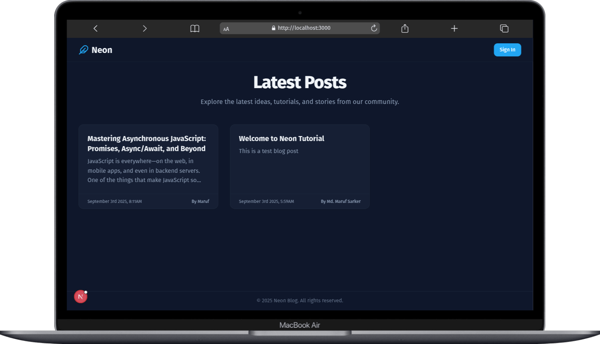
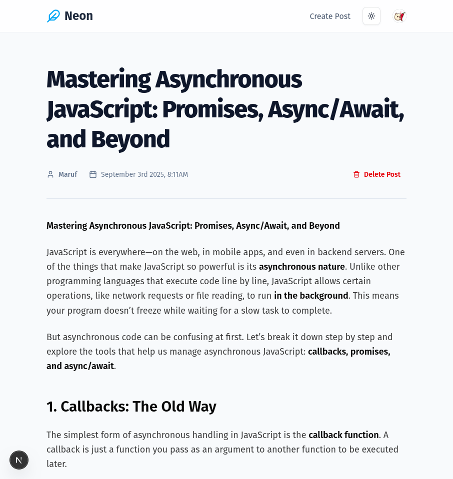

# Neon Blog with Next.js, Clerk, and Neon Postgres

A simple full-stack blog application using **Next.js**, **Clerk** for authentication, and **Neon Postgres** as the database.

## Demo




## Prerequisites

- Node.js (v20+)
- npm or yarn
- Neon Postgres account
- Clerk account

## Setup

1. **Clone the repository**

```bash
git clone https://github.com/maruf-pfc/freecodecamp/tree/main/nextjs-clerk-neon-fullstack-development/neon-blog-with-clerk
cd neon-blog-with-clerk
```

2. **Install dependencies**

```bash
npm install
# or
yarn
```

3. **Create environment variables**

Create a `.env` file at the root of the project:

```env
NEON_DATABASE_URL="postgres://<user>:<password>@<host>.neon.tech:<port>/<dbname>?sslmode=require"
NEXT_PUBLIC_CLERK_PUBLISHABLE_KEY=<your_publishable_key>
CLERK_SECRET_KEY=<your_secret_key>
```

1. **Setup the database with Drizzle ORM**

```bash
# Create tables
npm run db-create

# Generate migrations (optional)
npm run migrate
```

## Running the Project

Start the development server:

```bash
npm run dev
# or
yarn dev
```

Open [http://localhost:3000](http://localhost:3000) in your browser.

- Home page shows all posts
- `/posts/create` to create a new post (authentication required)
- `/posts/[slug]` to view individual posts

## Build for Production

```bash
npm run build
npm start
```
